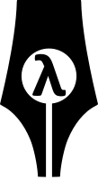

# λ-blog

**λ-blog** is a static blog generator generator optimized for customizability. It provides sane defaults but lets you override anything, ranging from HTML templates to the generation pipeline, essentially allowing you to build your own static blog generator.

## Usage

See the [API docs](https://idorobots.github.io/lambda-blog/api/) and the [sample blog](https://idorobots.github.io/lambda-blog/).

To create a blog using [Leiningen](leiningen.org) simply do the following in the console:

```
lein new lambda-blog name
```

Now you can generate & check out your static blog by runnig:

```
cd name
lein run
firefox out/index.html
```

Happy blogging!

## License

Copyright © 2015-2016 Kajetan Rzepecki <kajtek@idorobots.org>

Distributed under the MIT License. See LICENSE.txt for details.
